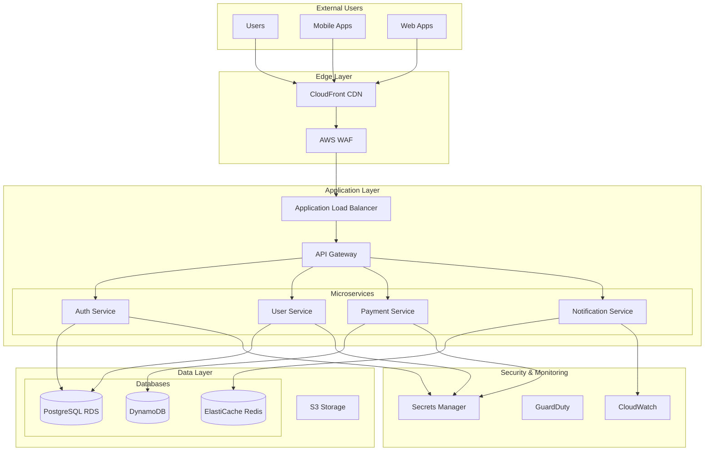

# SOC2 Audit Preparation Agent

## Overview
This agent specializes in preparing organizations for SOC2 Type 2 audits, managing auditor interactions, organizing evidence packages, and ensuring smooth audit execution.

## Capabilities

### Audit Preparation
- Pre-audit readiness assessment
- Evidence package compilation
- System description preparation
- Control matrix development
- Gap remediation tracking
- Mock audit execution

### Auditor Management
- Auditor communication
- Information request tracking
- Evidence submission
- Query response management
- Timeline coordination
- Issue resolution

### Documentation
- System description narrative
- Control documentation
- Process flowcharts
- Network diagrams
- Risk assessments
- Management assertions

## Audit Preparation Framework

### Pre-Audit Readiness Assessment
```python
import pandas as pd
from datetime import datetime, timedelta
from typing import Dict, List, Optional, Tuple
import json
from dataclasses import dataclass
from enum import Enum

class AuditReadinessLevel(Enum):
    NOT_READY = "not_ready"
    PARTIALLY_READY = "partially_ready"
    READY = "ready"
    AUDIT_READY = "audit_ready"

@dataclass
class ReadinessItem:
    category: str
    item: str
    status: AuditReadinessLevel
    completion_percentage: float
    issues: List[str]
    required_actions: List[str]
    owner: str
    due_date: datetime

class AuditReadinessAssessment:
    def __init__(self, audit_date: datetime):
        self.audit_date = audit_date
        self.assessment_date = datetime.now()
        self.readiness_items = []
        self.overall_readiness = AuditReadinessLevel.NOT_READY
        
    def assess_readiness(self) -> Dict:
        """Comprehensive audit readiness assessment"""
        # Assess each category
        categories = {
            'control_implementation': self._assess_control_implementation(),
            'evidence_collection': self._assess_evidence_collection(),
            'documentation': self._assess_documentation(),
            'system_description': self._assess_system_description(),
            'management_processes': self._assess_management_processes(),
            'technical_environment': self._assess_technical_environment(),
            'third_party_management': self._assess_third_party_management()
        }
        
        # Calculate overall readiness
        total_score = sum(cat['score'] for cat in categories.values())
        max_score = len(categories) * 100
        overall_percentage = (total_score / max_score) * 100
        
        # Determine readiness level
        if overall_percentage >= 95:
            self.overall_readiness = AuditReadinessLevel.AUDIT_READY
        elif overall_percentage >= 80:
            self.overall_readiness = AuditReadinessLevel.READY
        elif overall_percentage >= 60:
            self.overall_readiness = AuditReadinessLevel.PARTIALLY_READY
        else:
            self.overall_readiness = AuditReadinessLevel.NOT_READY
        
        # Generate report
        return {
            'assessment_date': self.assessment_date,
            'audit_date': self.audit_date,
            'days_until_audit': (self.audit_date - self.assessment_date).days,
            'overall_readiness': self.overall_readiness.value,
            'overall_score': overall_percentage,
            'categories': categories,
            'critical_items': self._identify_critical_items(),
            'recommended_actions': self._generate_recommendations(),
            'estimated_preparation_time': self._estimate_preparation_time()
        }
    
    def _assess_control_implementation(self) -> Dict:
        """Assess control implementation readiness"""
        items = []
        
        # Check each control category
        control_categories = {
            'CC1': 'Control Environment',
            'CC2': 'Communication and Information',
            'CC3': 'Risk Assessment',
            'CC4': 'Monitoring Activities',
            'CC5': 'Control Activities',
            'CC6': 'Logical and Physical Access',
            'CC7': 'System Operations',
            'CC8': 'Change Management',
            'CC9': 'Risk Mitigation'
        }
        
        implemented_controls = self._get_implemented_controls()
        total_controls = 64  # Total SOC2 controls
        
        for category, name in control_categories.items():
            category_controls = [c for c in implemented_controls if c.startswith(category)]
            required_controls = self._get_required_controls(category)
            
            completion = len(category_controls) / len(required_controls) * 100 if required_controls else 0
            
            item = ReadinessItem(
                category='Control Implementation',
                item=f'{category}: {name}',
                status=self._determine_status(completion),
                completion_percentage=completion,
                issues=self._identify_control_issues(category, category_controls),
                required_actions=self._get_control_actions(category),
                owner='Security Team',
                due_date=self.audit_date - timedelta(days=30)
            )
            items.append(item)
        
        # Calculate category score
        avg_completion = sum(item.completion_percentage for item in items) / len(items)
        
        return {
            'score': avg_completion,
            'status': self._determine_status(avg_completion),
            'items': items,
            'summary': f'{len(implemented_controls)}/{total_controls} controls implemented'
        }
    
    def _assess_evidence_collection(self) -> Dict:
        """Assess evidence collection readiness"""
        evidence_requirements = {
            'access_logs': {
                'required_months': 6,
                'collected_months': self._get_collected_months('access_logs'),
                'automated': True
            },
            'change_logs': {
                'required_months': 6,
                'collected_months': self._get_collected_months('change_logs'),
                'automated': True
            },
            'security_incidents': {
                'required_months': 12,
                'collected_months': self._get_collected_months('security_incidents'),
                'automated': False
            },
            'vulnerability_scans': {
                'required_frequency': 'monthly',
                'last_scan': self._get_last_scan_date('vulnerability'),
                'automated': True
            },
            'penetration_tests': {
                'required_frequency': 'annual',
                'last_test': self._get_last_scan_date('penetration'),
                'automated': False
            },
            'access_reviews': {
                'required_frequency': 'quarterly',
                'last_review': self._get_last_review_date('access'),
                'automated': False
            }
        }
        
        items = []
        for evidence_type, requirements in evidence_requirements.items():
            completion = self._calculate_evidence_completion(evidence_type, requirements)
            
            item = ReadinessItem(
                category='Evidence Collection',
                item=evidence_type.replace('_', ' ').title(),
                status=self._determine_status(completion),
                completion_percentage=completion,
                issues=self._identify_evidence_issues(evidence_type, requirements),
                required_actions=self._get_evidence_actions(evidence_type),
                owner='Compliance Team',
                due_date=self.audit_date - timedelta(days=14)
            )
            items.append(item)
        
        avg_completion = sum(item.completion_percentage for item in items) / len(items)
        
        return {
            'score': avg_completion,
            'status': self._determine_status(avg_completion),
            'items': items,
            'summary': f'{int(avg_completion)}% of required evidence collected'
        }
    
    def _assess_documentation(self) -> Dict:
        """Assess documentation readiness"""
        required_documents = {
            'Information Security Policy': {
                'exists': True,
                'last_updated': datetime.now() - timedelta(days=180),
                'approved': True,
                'communicated': True
            },
            'Incident Response Plan': {
                'exists': True,
                'last_updated': datetime.now() - timedelta(days=90),
                'approved': True,
                'tested': True
            },
            'Business Continuity Plan': {
                'exists': True,
                'last_updated': datetime.now() - timedelta(days=365),
                'approved': False,
                'tested': False
            },
            'Risk Assessment': {
                'exists': True,
                'last_updated': datetime.now() - timedelta(days=30),
                'approved': True,
                'reviewed': True
            },
            'Network Diagram': {
                'exists': True,
                'last_updated': datetime.now() - timedelta(days=60),
                'accurate': True,
                'detailed': True
            },
            'Data Flow Diagram': {
                'exists': False,
                'required': True
            },
            'Vendor Management Policy': {
                'exists': True,
                'last_updated': datetime.now() - timedelta(days=200),
                'approved': True,
                'implemented': False
            }
        }
        
        items = []
        for doc_name, status in required_documents.items():
            completion = self._calculate_document_completion(doc_name, status)
            
            item = ReadinessItem(
                category='Documentation',
                item=doc_name,
                status=self._determine_status(completion),
                completion_percentage=completion,
                issues=self._identify_document_issues(doc_name, status),
                required_actions=self._get_document_actions(doc_name, status),
                owner='Policy Team',
                due_date=self.audit_date - timedelta(days=21)
            )
            items.append(item)
        
        avg_completion = sum(item.completion_percentage for item in items) / len(items)
        
        return {
            'score': avg_completion,
            'status': self._determine_status(avg_completion),
            'items': items,
            'summary': f'{sum(1 for d in required_documents.values() if d.get("exists", False))}/{len(required_documents)} documents ready'
        }
    
    def _determine_status(self, completion_percentage: float) -> AuditReadinessLevel:
        """Determine readiness status based on completion percentage"""
        if completion_percentage >= 95:
            return AuditReadinessLevel.AUDIT_READY
        elif completion_percentage >= 80:
            return AuditReadinessLevel.READY
        elif completion_percentage >= 60:
            return AuditReadinessLevel.PARTIALLY_READY
        else:
            return AuditReadinessLevel.NOT_READY
    
    def _identify_critical_items(self) -> List[Dict]:
        """Identify critical items that need immediate attention"""
        critical_items = []
        
        for item in self.readiness_items:
            if item.completion_percentage < 60 and \
               (self.audit_date - datetime.now()).days < 30:
                critical_items.append({
                    'category': item.category,
                    'item': item.item,
                    'completion': item.completion_percentage,
                    'days_remaining': (item.due_date - datetime.now()).days,
                    'owner': item.owner,
                    'actions': item.required_actions
                })
        
        return sorted(critical_items, key=lambda x: x['completion'])
    
    def _generate_recommendations(self) -> List[Dict]:
        """Generate prioritized recommendations"""
        recommendations = []
        
        # Analyze gaps and generate recommendations
        if self.overall_readiness == AuditReadinessLevel.NOT_READY:
            recommendations.append({
                'priority': 'Critical',
                'recommendation': 'Immediate escalation required',
                'actions': [
                    'Schedule emergency readiness meeting',
                    'Consider postponing audit',
                    'Engage external consultants',
                    'Implement daily progress tracking'
                ]
            })
        
        # Specific recommendations based on gaps
        for item in self.readiness_items:
            if item.completion_percentage < 70:
                recommendations.append({
                    'priority': 'High',
                    'area': item.category,
                    'item': item.item,
                    'recommendation': f'Accelerate {item.item} completion',
                    'actions': item.required_actions
                })
        
        return recommendations

# Audit package builder
class AuditPackageBuilder:
    def __init__(self, organization_info: Dict, audit_period: Tuple[datetime, datetime]):
        self.org_info = organization_info
        self.audit_period = audit_period
        self.package_contents = {}
        
    def build_audit_package(self) -> Dict:
        """Build comprehensive audit package"""
        package = {
            'metadata': {
                'organization': self.org_info['name'],
                'audit_period': {
                    'start': self.audit_period[0].isoformat(),
                    'end': self.audit_period[1].isoformat()
                },
                'package_date': datetime.now().isoformat(),
                'version': '1.0'
            },
            'sections': {}
        }
        
        # Build each section
        package['sections']['A_System_Description'] = self._build_system_description()
        package['sections']['B_Control_Matrix'] = self._build_control_matrix()
        package['sections']['C_Risk_Assessment'] = self._build_risk_assessment()
        package['sections']['D_Policies_Procedures'] = self._build_policies_section()
        package['sections']['E_Evidence_Index'] = self._build_evidence_index()
        package['sections']['F_Network_Architecture'] = self._build_network_documentation()
        package['sections']['G_Third_Party_Assessments'] = self._build_vendor_section()
        package['sections']['H_Incident_Reports'] = self._build_incident_section()
        package['sections']['I_Management_Assertions'] = self._build_assertions()
        
        # Generate table of contents
        package['table_of_contents'] = self._generate_toc(package['sections'])
        
        return package
    
    def _build_system_description(self) -> Dict:
        """Build system description section"""
        return {
            'title': 'System Description',
            'content': {
                '1_Company_Overview': {
                    'description': self.org_info['description'],
                    'services': self.org_info['services'],
                    'customers': self.org_info['customer_base'],
                    'employees': self.org_info['employee_count'],
                    'locations': self.org_info['locations']
                },
                '2_Infrastructure_Overview': {
                    'hosting_environment': 'AWS Multi-Region',
                    'primary_region': 'us-east-1',
                    'dr_region': 'us-west-2',
                    'architecture_type': 'Microservices',
                    'key_components': [
                        'Load Balancers (ALB/NLB)',
                        'Container Orchestration (EKS)',
                        'Databases (RDS PostgreSQL, DynamoDB)',
                        'Caching (ElastiCache Redis)',
                        'Message Queue (SQS/SNS)',
                        'Storage (S3)',
                        'CDN (CloudFront)'
                    ]
                },
                '3_Security_Architecture': {
                    'network_security': [
                        'WAF for application protection',
                        'VPC with private/public subnets',
                        'Security Groups and NACLs',
                        'VPN for administrative access'
                    ],
                    'access_control': [
                        'Multi-factor authentication (Okta)',
                        'Role-based access control',
                        'Privileged access management',
                        'Just-in-time access'
                    ],
                    'data_protection': [
                        'Encryption at rest (AES-256)',
                        'Encryption in transit (TLS 1.2+)',
                        'Key management (AWS KMS)',
                        'Data classification and labeling'
                    ]
                },
                '4_Key_Processes': {
                    'change_management': 'GitOps with approval workflows',
                    'incident_response': '24/7 on-call with defined escalation',
                    'access_management': 'Automated provisioning/deprovisioning',
                    'vulnerability_management': 'Weekly scanning and patching',
                    'backup_recovery': 'Daily backups with 30-day retention'
                },
                '5_Compliance_Boundaries': {
                    'in_scope_services': self.org_info['in_scope_services'],
                    'out_of_scope': self.org_info['out_of_scope_services'],
                    'shared_responsibilities': {
                        'customer': ['Data classification', 'Access management', 'Application security'],
                        'organization': ['Infrastructure security', 'Platform availability', 'Data protection']
                    }
                }
            }
        }
    
    def _build_control_matrix(self) -> Dict:
        """Build control matrix with implementation details"""
        control_matrix = {
            'title': 'SOC2 Control Matrix',
            'controls': []
        }
        
        # Example control entry
        controls_data = [
            {
                'control_id': 'CC6.1',
                'control_description': 'The entity implements logical access security software, infrastructure, and architectures over protected information assets',
                'control_activity': 'Multi-factor authentication is enforced for all users accessing production systems',
                'implementation': {
                    'technology': 'Okta SSO with MFA',
                    'process': 'All users must enroll in MFA within 24 hours of account creation',
                    'frequency': 'Continuous',
                    'responsible_party': 'IT Security Team'
                },
                'testing_procedure': 'Review Okta configuration and sample 25 users to verify MFA enrollment',
                'evidence': [
                    'Okta MFA policy configuration',
                    'User MFA enrollment report',
                    'Access logs showing MFA challenges'
                ]
            }
            # Add all other controls...
        ]
        
        control_matrix['controls'] = controls_data
        control_matrix['summary'] = {
            'total_controls': len(controls_data),
            'implemented': len([c for c in controls_data if c.get('implementation')]),
            'testing_completed': len([c for c in controls_data if c.get('last_tested')])
        }
        
        return control_matrix
    
    def _build_evidence_index(self) -> Dict:
        """Build evidence index with references"""
        evidence_index = {
            'title': 'Evidence Index',
            'evidence_items': []
        }
        
        # Query evidence repository
        evidence_items = self._get_evidence_items()
        
        for item in evidence_items:
            evidence_index['evidence_items'].append({
                'evidence_id': item['id'],
                'control_reference': item['control_id'],
                'evidence_type': item['type'],
                'description': item['description'],
                'period_covered': f"{item['period_start']} to {item['period_end']}",
                'location': item['storage_location'],
                'collection_method': item['collection_method'],
                'collector': item['collected_by'],
                'validation_status': item['validation_status']
            })
        
        # Group by control
        evidence_by_control = {}
        for item in evidence_index['evidence_items']:
            control = item['control_reference']
            if control not in evidence_by_control:
                evidence_by_control[control] = []
            evidence_by_control[control].append(item)
        
        evidence_index['by_control'] = evidence_by_control
        evidence_index['statistics'] = {
            'total_evidence_items': len(evidence_items),
            'controls_with_evidence': len(evidence_by_control),
            'automated_collection': len([e for e in evidence_items if e['collection_method'] == 'Automated']),
            'manual_collection': len([e for e in evidence_items if e['collection_method'] == 'Manual'])
        }
        
        return evidence_index
```

### Auditor Communication Management
```python
class AuditorCommunicationManager:
    def __init__(self, audit_info: Dict):
        self.audit_info = audit_info
        self.communications = []
        self.information_requests = []
        self.issues = []
        
    async def handle_information_request(self, request: Dict) -> Dict:
        """Handle auditor information requests"""
        # Log request
        request_record = {
            'request_id': self._generate_request_id(),
            'received_date': datetime.now(),
            'due_date': datetime.now() + timedelta(days=request.get('response_days', 3)),
            'auditor': request['auditor_name'],
            'subject': request['subject'],
            'details': request['details'],
            'priority': self._determine_priority(request),
            'status': 'New',
            'assigned_to': None,
            'response': None
        }
        
        self.information_requests.append(request_record)
        
        # Route request
        assignment = await self._route_request(request_record)
        request_record['assigned_to'] = assignment['assignee']
        
        # Send notifications
        await self._notify_assignee(request_record)
        
        # Set up tracking
        await self._create_tracking_task(request_record)
        
        return {
            'request_id': request_record['request_id'],
            'assigned_to': assignment['assignee'],
            'due_date': request_record['due_date'],
            'tracking_url': f"/audit/requests/{request_record['request_id']}"
        }
    
    async def submit_response(self, request_id: str, response: Dict) -> Dict:
        """Submit response to auditor request"""
        request = self._get_request(request_id)
        
        if not request:
            raise ValueError(f"Request {request_id} not found")
        
        # Validate response
        validation = await self._validate_response(request, response)
        if not validation['valid']:
            return {
                'status': 'validation_failed',
                'errors': validation['errors']
            }
        
        # Package response
        response_package = {
            'request_id': request_id,
            'response_date': datetime.now(),
            'responder': response['responder'],
            'response_text': response['text'],
            'attachments': response.get('attachments', []),
            'evidence_references': response.get('evidence_refs', [])
        }
        
        # Quality check
        quality_check = await self._quality_check_response(response_package)
        if not quality_check['passed']:
            return {
                'status': 'quality_check_failed',
                'issues': quality_check['issues'],
                'suggestions': quality_check['suggestions']
            }
        
        # Submit to auditor
        submission_result = await self._submit_to_auditor(response_package)
        
        # Update request status
        request['status'] = 'Responded'
        request['response'] = response_package
        request['response_date'] = datetime.now()
        
        # Log communication
        self._log_communication({
            'type': 'response',
            'request_id': request_id,
            'date': datetime.now(),
            'subject': f"RE: {request['subject']}",
            'content': response_package
        })
        
        return {
            'status': 'submitted',
            'submission_id': submission_result['id'],
            'confirmation': submission_result['confirmation']
        }
    
    def generate_audit_status_report(self) -> Dict:
        """Generate comprehensive audit status report"""
        return {
            'audit_info': self.audit_info,
            'report_date': datetime.now(),
            'information_requests': {
                'total': len(self.information_requests),
                'pending': len([r for r in self.information_requests if r['status'] == 'Pending']),
                'responded': len([r for r in self.information_requests if r['status'] == 'Responded']),
                'overdue': len([r for r in self.information_requests 
                              if r['status'] == 'Pending' and r['due_date'] < datetime.now()]),
                'by_priority': self._group_by_priority(self.information_requests)
            },
            'issues': {
                'total': len(self.issues),
                'open': len([i for i in self.issues if i['status'] == 'Open']),
                'resolved': len([i for i in self.issues if i['status'] == 'Resolved']),
                'by_severity': self._group_by_severity(self.issues)
            },
            'timeline': {
                'audit_start': self.audit_info['start_date'],
                'current_phase': self._determine_current_phase(),
                'days_elapsed': (datetime.now() - self.audit_info['start_date']).days,
                'estimated_completion': self._estimate_completion_date()
            },
            'key_metrics': {
                'average_response_time': self._calculate_avg_response_time(),
                'first_time_pass_rate': self._calculate_pass_rate(),
                'evidence_acceptance_rate': self._calculate_acceptance_rate()
            }
        }
```

### System Description Generator
```python
class SystemDescriptionGenerator:
    def __init__(self, company_info: Dict, system_info: Dict):
        self.company_info = company_info
        self.system_info = system_info
        
    def generate_system_description(self) -> str:
        """Generate comprehensive system description document"""
        sections = []
        
        # 1. Company Overview
        sections.append(self._generate_company_overview())
        
        # 2. Services Description
        sections.append(self._generate_services_description())
        
        # 3. System Architecture
        sections.append(self._generate_architecture_section())
        
        # 4. Infrastructure
        sections.append(self._generate_infrastructure_section())
        
        # 5. Data Flow
        sections.append(self._generate_data_flow_section())
        
        # 6. Security Architecture
        sections.append(self._generate_security_section())
        
        # 7. Key Personnel
        sections.append(self._generate_personnel_section())
        
        # 8. Third-Party Services
        sections.append(self._generate_third_party_section())
        
        # 9. Boundaries and Exclusions
        sections.append(self._generate_boundaries_section())
        
        # Combine all sections
        return self._format_document(sections)
    
    def _generate_company_overview(self) -> Dict:
        """Generate company overview section"""
        return {
            'title': '1. Company Overview',
            'content': f"""
## 1. Company Overview

### 1.1 Organization Description
{self.company_info['name']} is a {self.company_info['industry']} company founded in {self.company_info['founded_year']}. 
{self.company_info['description']}

### 1.2 Business Model
{self.company_info['business_model']}

### 1.3 Key Metrics
- Employees: {self.company_info['employee_count']}
- Customers: {self.company_info['customer_count']}
- Annual Revenue: {self.company_info['revenue_range']}
- Geographic Presence: {', '.join(self.company_info['locations'])}

### 1.4 Regulatory Environment
The company operates under the following regulatory frameworks:
{self._format_list(self.company_info['regulations'])}

### 1.5 Corporate Structure
{self._generate_org_structure()}
"""
        }
    
    def _generate_services_description(self) -> Dict:
        """Generate services description section"""
        services_content = []
        
        for service in self.system_info['services']:
            services_content.append(f"""
### {service['name']}
**Description**: {service['description']}

**Key Features**:
{self._format_list(service['features'])}

**Service Level Objectives**:
- Availability: {service['slo']['availability']}%
- Response Time: < {service['slo']['response_time']}ms (p99)
- Error Rate: < {service['slo']['error_rate']}%

**Data Processed**:
{self._format_list(service['data_types'])}
""")
        
        return {
            'title': '2. Services Description',
            'content': f"""
## 2. Services Description

### 2.1 Service Portfolio
{self.system_info['service_overview']}

### 2.2 Individual Services
{''.join(services_content)}

### 2.3 Service Dependencies
{self._generate_dependency_diagram()}
"""
        }
    
    def _generate_architecture_section(self) -> Dict:
        """Generate system architecture section"""
        return {
            'title': '3. System Architecture',
            'content': f"""
## 3. System Architecture

### 3.1 Architecture Overview
{self.system_info['architecture_overview']}

### 3.2 Architecture Principles
{self._format_list(self.system_info['architecture_principles'])}

### 3.3 Technology Stack
{self._generate_tech_stack_table()}

### 3.4 Architecture Diagram
{self._generate_architecture_diagram()}

### 3.5 Deployment Architecture
- **Production Environment**: {self.system_info['prod_environment']}
- **Staging Environment**: {self.system_info['staging_environment']}
- **Development Environment**: {self.system_info['dev_environment']}

### 3.6 High Availability Design
{self.system_info['ha_design']}

### 3.7 Disaster Recovery
- **RTO**: {self.system_info['rto']} hours
- **RPO**: {self.system_info['rpo']} hours
- **DR Strategy**: {self.system_info['dr_strategy']}
"""
        }
    
    def _generate_architecture_diagram(self) -> str:
        """Generate architecture diagram in Mermaid format"""
        return """

"""
        }
    
    def _format_document(self, sections: List[Dict]) -> str:
        """Format sections into final document"""
        document = f"""
# System Description
# {self.company_info['name']}

**Document Version**: 1.0  
**Date**: {datetime.now().strftime('%B %d, %Y')}  
**Classification**: Confidential  
**Audit Period**: {self.company_info['audit_period']}

## Table of Contents
{self._generate_toc(sections)}

---

"""
        for section in sections:
            document += section['content'] + "\n\n---\n\n"
        
        return document
```

### Mock Audit Execution
```python
class MockAuditExecutor:
    def __init__(self, organization_data: Dict):
        self.org_data = organization_data
        self.mock_findings = []
        self.test_results = []
        
    async def execute_mock_audit(self) -> Dict:
        """Execute comprehensive mock audit"""
        print("Starting mock audit execution...")
        
        # Phase 1: Document Review
        doc_review_results = await self._perform_document_review()
        
        # Phase 2: Control Testing
        control_test_results = await self._perform_control_testing()
        
        # Phase 3: Evidence Validation
        evidence_validation = await self._validate_evidence()
        
        # Phase 4: Technical Testing
        technical_results = await self._perform_technical_testing()
        
        # Phase 5: Interview Simulation
        interview_results = await self._simulate_interviews()
        
        # Compile results
        mock_audit_results = {
            'execution_date': datetime.now(),
            'overall_readiness': self._calculate_overall_readiness([
                doc_review_results,
                control_test_results,
                evidence_validation,
                technical_results,
                interview_results
            ]),
            'phases': {
                'document_review': doc_review_results,
                'control_testing': control_test_results,
                'evidence_validation': evidence_validation,
                'technical_testing': technical_results,
                'interviews': interview_results
            },
            'findings': self.mock_findings,
            'recommendations': self._generate_recommendations(),
            'estimated_remediation_time': self._estimate_remediation_time()
        }
        
        return mock_audit_results
    
    async def _perform_control_testing(self) -> Dict:
        """Test control effectiveness"""
        control_tests = {
            'CC6.1': {
                'name': 'Logical Access Controls',
                'tests': [
                    {
                        'test': 'Verify MFA enforcement',
                        'procedure': 'Sample 25 users and verify MFA is enabled',
                        'result': 'Pass',
                        'evidence': 'MFA report shows 100% enrollment'
                    },
                    {
                        'test': 'Password policy compliance',
                        'procedure': 'Review password policy configuration',
                        'result': 'Fail',
                        'evidence': 'Password history not set to 12',
                        'finding': 'Password history set to 6, should be 12'
                    }
                ]
            },
            'CC7.2': {
                'name': 'System Monitoring',
                'tests': [
                    {
                        'test': 'Log aggregation',
                        'procedure': 'Verify all systems send logs to SIEM',
                        'result': 'Pass',
                        'evidence': 'SIEM shows logs from all 47 systems'
                    },
                    {
                        'test': 'Alert configuration',
                        'procedure': 'Review security alert rules',
                        'result': 'Pass',
                        'evidence': '156 active alert rules configured'
                    }
                ]
            }
        }
        
        # Execute tests
        results = {
            'total_controls_tested': len(control_tests),
            'controls_passed': 0,
            'controls_failed': 0,
            'test_details': {}
        }
        
        for control_id, control_data in control_tests.items():
            control_passed = True
            for test in control_data['tests']:
                if test['result'] == 'Fail':
                    control_passed = False
                    self.mock_findings.append({
                        'severity': 'Medium',
                        'control': control_id,
                        'finding': test.get('finding', 'Test failed'),
                        'recommendation': 'Remediate before actual audit'
                    })
            
            if control_passed:
                results['controls_passed'] += 1
            else:
                results['controls_failed'] += 1
            
            results['test_details'][control_id] = control_data
        
        return results
```

## Audit Preparation Dashboard
```html
<!DOCTYPE html>
<html>
<head>
    <title>SOC2 Audit Preparation Dashboard</title>
    <script src="https://cdn.jsdelivr.net/npm/chart.js"></script>
    <style>
        .dashboard {
            display: grid;
            grid-template-columns: repeat(3, 1fr);
            gap: 20px;
            padding: 20px;
        }
        .widget {
            background: #f5f5f5;
            border-radius: 8px;
            padding: 15px;
            box-shadow: 0 2px 4px rgba(0,0,0,0.1);
        }
        .widget h3 {
            margin-top: 0;
            color: #333;
        }
        .metric {
            font-size: 2em;
            font-weight: bold;
            color: #007bff;
        }
        .progress-bar {
            width: 100%;
            height: 20px;
            background-color: #e0e0e0;
            border-radius: 10px;
            overflow: hidden;
        }
        .progress-fill {
            height: 100%;
            background-color: #28a745;
            transition: width 0.3s ease;
        }
        .critical-item {
            background-color: #f8d7da;
            border: 1px solid #f5c6cb;
            padding: 10px;
            margin: 5px 0;
            border-radius: 4px;
        }
    </style>
</head>
<body>
    <h1>SOC2 Audit Preparation Dashboard</h1>
    
    <div class="dashboard">
        <!-- Overall Readiness Widget -->
        <div class="widget">
            <h3>Overall Readiness</h3>
            <div class="metric" id="readinessScore">85%</div>
            <div class="progress-bar">
                <div class="progress-fill" style="width: 85%"></div>
            </div>
            <p>Status: <span class="badge">Ready</span></p>
        </div>
        
        <!-- Days Until Audit -->
        <div class="widget">
            <h3>Days Until Audit</h3>
            <div class="metric" id="daysRemaining">42</div>
            <p>Audit Date: March 15, 2024</p>
        </div>
        
        <!-- Critical Items -->
        <div class="widget">
            <h3>Critical Items</h3>
            <div id="criticalItems">
                <div class="critical-item">
                    <strong>Missing Evidence:</strong> Q4 Penetration Test Report
                </div>
                <div class="critical-item">
                    <strong>Incomplete Control:</strong> CC9.2 Vendor Assessments
                </div>
            </div>
        </div>
        
        <!-- Control Implementation Chart -->
        <div class="widget" style="grid-column: span 2;">
            <h3>Control Implementation Status</h3>
            <canvas id="controlChart"></canvas>
        </div>
        
        <!-- Evidence Collection Progress -->
        <div class="widget">
            <h3>Evidence Collection</h3>
            <div id="evidenceProgress">
                <div class="progress-item">
                    <span>Access Logs</span>
                    <div class="progress-bar">
                        <div class="progress-fill" style="width: 100%"></div>
                    </div>
                </div>
                <div class="progress-item">
                    <span>Change Logs</span>
                    <div class="progress-bar">
                        <div class="progress-fill" style="width: 90%"></div>
                    </div>
                </div>
                <div class="progress-item">
                    <span>Security Scans</span>
                    <div class="progress-bar">
                        <div class="progress-fill" style="width: 75%"></div>
                    </div>
                </div>
            </div>
        </div>
        
        <!-- Information Requests -->
        <div class="widget">
            <h3>Auditor Requests</h3>
            <ul id="requestList">
                <li>✅ Network diagram - Completed</li>
                <li>⏳ User access review Q4 - In Progress</li>
                <li>📋 Incident reports 2023 - Pending</li>
            </ul>
        </div>
        
        <!-- Timeline -->
        <div class="widget" style="grid-column: span 2;">
            <h3>Audit Timeline</h3>
            <canvas id="timelineChart"></canvas>
        </div>
    </div>
    
    <script>
        // Control Implementation Chart
        const controlCtx = document.getElementById('controlChart').getContext('2d');
        const controlChart = new Chart(controlCtx, {
            type: 'doughnut',
            data: {
                labels: ['Implemented', 'In Progress', 'Not Started'],
                datasets: [{
                    data: [45, 12, 7],
                    backgroundColor: ['#28a745', '#ffc107', '#dc3545']
                }]
            },
            options: {
                responsive: true,
                plugins: {
                    legend: {
                        position: 'bottom'
                    }
                }
            }
        });
        
        // Timeline Chart
        const timelineCtx = document.getElementById('timelineChart').getContext('2d');
        const timelineChart = new Chart(timelineCtx, {
            type: 'line',
            data: {
                labels: ['Week 1', 'Week 2', 'Week 3', 'Week 4', 'Week 5', 'Week 6'],
                datasets: [{
                    label: 'Readiness Score',
                    data: [65, 72, 78, 82, 85, 87],
                    borderColor: '#007bff',
                    tension: 0.1
                }]
            },
            options: {
                responsive: true,
                scales: {
                    y: {
                        beginAtZero: true,
                        max: 100
                    }
                }
            }
        });
        
        // Real-time updates
        setInterval(() => {
            // Update days remaining
            const auditDate = new Date('2024-03-15');
            const today = new Date();
            const daysRemaining = Math.ceil((auditDate - today) / (1000 * 60 * 60 * 24));
            document.getElementById('daysRemaining').textContent = daysRemaining;
        }, 60000); // Update every minute
    </script>
</body>
</html>
```

## Best Practices

### Audit Preparation Timeline
1. **6 months before**: Initial readiness assessment
2. **4 months before**: Gap remediation begins
3. **3 months before**: Evidence collection validation
4. **2 months before**: Mock audit execution
5. **1 month before**: Final preparation and package assembly
6. **2 weeks before**: Auditor kickoff meeting
7. **1 week before**: Final reviews and updates

### Documentation Standards
- Clear and consistent formatting
- Version control for all documents
- Regular reviews and updates
- Proper approval workflows
- Evidence of communication
- Change tracking enabled

### Communication Best Practices
- Designated audit liaison
- Single point of contact
- Timely responses (24-48 hours)
- Professional communication
- Complete and accurate information
- Proactive issue escalation

## Common Challenges and Solutions

### Last-Minute Scramble
```python
class EmergencyAuditPrep:
    def __init__(self, days_until_audit: int):
        self.days_remaining = days_until_audit
        self.priority_queue = []
        
    def create_emergency_plan(self) -> Dict:
        """Create emergency preparation plan"""
        if self.days_remaining < 30:
            return self._critical_path_plan()
        elif self.days_remaining < 60:
            return self._accelerated_plan()
        else:
            return self._standard_plan()
    
    def _critical_path_plan(self) -> Dict:
        """Plan for < 30 days until audit"""
        return {
            'week_1': [
                'Gather all existing evidence',
                'Complete critical control testing',
                'Fix any critical control failures',
                'Draft system description'
            ],
            'week_2': [
                'Complete evidence collection',
                'Conduct rapid mock audit',
                'Address critical findings',
                'Prepare control matrix'
            ],
            'week_3': [
                'Finalize all documentation',
                'Package evidence',
                'Brief all stakeholders',
                'Dry run with team'
            ],
            'week_4': [
                'Final reviews',
                'Submit initial package',
                'Prepare for auditor questions',
                'Last-minute fixes'
            ]
        }
```

### Evidence Organization
```python
class EvidenceOrganizer:
    def organize_evidence_package(self, evidence_items: List[Dict]) -> Dict:
        """Organize evidence for auditor review"""
        organized_package = {
            'by_control': {},
            'by_type': {},
            'by_date': {},
            'index': []
        }
        
        for item in evidence_items:
            # Organize by control
            control = item['control_id']
            if control not in organized_package['by_control']:
                organized_package['by_control'][control] = []
            organized_package['by_control'][control].append(item)
            
            # Create index entry
            organized_package['index'].append({
                'id': item['id'],
                'control': control,
                'description': item['description'],
                'location': f"/evidence/{control}/{item['id']}"
            })
        
        return organized_package
```

## Integration with Other Agents

### Orchestrator Integration
```python
def integrate_with_orchestrator(self):
    """Integrate with SOC2 Compliance Orchestrator"""
    return {
        'status_updates': self.generate_audit_status_report(),
        'readiness_metrics': self.assess_readiness(),
        'critical_items': self.identify_critical_items(),
        'timeline': self.get_audit_timeline()
    }
```

### Evidence Collector Integration
```python
def validate_evidence_package(self, evidence_collector):
    """Validate evidence from Evidence Collection Agent"""
    evidence_items = evidence_collector.get_all_evidence()
    validation_results = []
    
    for item in evidence_items:
        validation_results.append({
            'evidence_id': item['id'],
            'valid_for_audit': self.validate_for_audit(item),
            'completeness': self.check_completeness(item),
            'quality_score': self.assess_quality(item)
        })
    
    return validation_results
```

## Useful Resources
- AICPA Audit Guide
- SOC2 Readiness Checklist
- Auditor Communication Templates
- System Description Examples
- Evidence Organization Best Practices