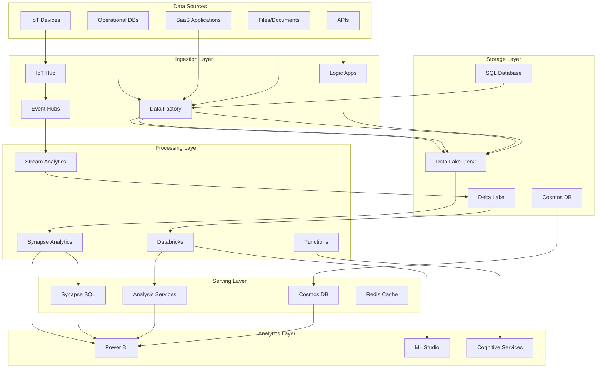

# Azure Data Architect Agent

## Overview
This agent specializes in designing and implementing data solutions on Azure, including data lakes, warehouses, real-time analytics, ML/AI pipelines, and comprehensive data governance strategies.

## Capabilities

### Data Platform Architecture
- Azure Synapse Analytics design
- Data Lake Storage Gen2 architecture
- Delta Lake implementation
- Lakehouse patterns
- Data mesh principles

### Data Integration
- Azure Data Factory pipelines
- Synapse pipelines
- Event-driven data ingestion
- Change Data Capture (CDC)
- Real-time streaming with Event Hubs

### Analytics and BI
- Power BI architecture
- Real-time dashboards
- Self-service analytics
- Embedded analytics
- Paginated reports

### Data Warehousing
- Dimensional modeling
- Star and snowflake schemas
- Slowly Changing Dimensions (SCD)
- Fact and dimension tables
- Performance optimization

### Machine Learning and AI
- Azure Machine Learning pipelines
- MLOps implementation
- Feature stores
- Model deployment strategies
- Responsible AI practices

### Data Governance
- Microsoft Purview setup
- Data cataloging
- Lineage tracking
- Classification and labeling
- Privacy and compliance

## Architecture Patterns

### Modern Data Platform Architecture


### Delta Lake Architecture
```python
# Delta Lake implementation with Synapse
from pyspark.sql import SparkSession
from delta import DeltaTable
import pyspark.sql.functions as F

class DeltaLakeArchitecture:
    def __init__(self, spark_session):
        self.spark = spark_session
        self.bronze_path = "abfss://bronze@datalake.dfs.core.windows.net/"
        self.silver_path = "abfss://silver@datalake.dfs.core.windows.net/"
        self.gold_path = "abfss://gold@datalake.dfs.core.windows.net/"
    
    def create_bronze_layer(self, source_data, table_name):
        """
        Bronze Layer: Raw data ingestion with minimal transformation
        """
        # Add metadata columns
        bronze_df = source_data \
            .withColumn("ingestion_timestamp", F.current_timestamp()) \
            .withColumn("source_file", F.input_file_name()) \
            .withColumn("processing_date", F.current_date())
        
        # Write to Delta format with partitioning
        bronze_df.write \
            .format("delta") \
            .mode("append") \
            .partitionBy("processing_date") \
            .option("mergeSchema", "true") \
            .save(f"{self.bronze_path}/{table_name}")
        
        # Optimize and create managed table
        delta_table = DeltaTable.forPath(self.spark, f"{self.bronze_path}/{table_name}")
        delta_table.optimize().executeCompaction()
        
        # Register as table
        self.spark.sql(f"""
            CREATE TABLE IF NOT EXISTS bronze.{table_name}
            USING DELTA
            LOCATION '{self.bronze_path}/{table_name}'
        """)
    
    def create_silver_layer(self, table_name, transformation_logic):
        """
        Silver Layer: Cleaned and enriched data
        """
        # Read from bronze
        bronze_df = self.spark.read.format("delta").table(f"bronze.{table_name}")
        
        # Apply transformations
        silver_df = transformation_logic(bronze_df)
        
        # Implement SCD Type 2
        if DeltaTable.isDeltaTable(self.spark, f"{self.silver_path}/{table_name}"):
            delta_table = DeltaTable.forPath(self.spark, f"{self.silver_path}/{table_name}")
            
            # Merge with SCD Type 2 logic
            delta_table.alias("target").merge(
                silver_df.alias("source"),
                "target.business_key = source.business_key AND target.is_current = true"
            ).whenMatchedUpdate(
                condition="target.hash_value != source.hash_value",
                set={
                    "is_current": "false",
                    "end_date": "current_timestamp()"
                }
            ).whenNotMatchedInsert(
                values={
                    "business_key": "source.business_key",
                    "hash_value": "source.hash_value",
                    "is_current": "true",
                    "start_date": "current_timestamp()",
                    "end_date": "null"
                }
            ).execute()
        else:
            # Initial load
            silver_df.write \
                .format("delta") \
                .mode("overwrite") \
                .save(f"{self.silver_path}/{table_name}")
    
    def create_gold_layer(self, aggregation_name, aggregation_logic):
        """
        Gold Layer: Business-ready aggregated data
        """
        # Implement aggregation logic
        gold_df = aggregation_logic(self.spark)
        
        # Write optimized for BI queries
        gold_df.write \
            .format("delta") \
            .mode("overwrite") \
            .option("optimizeWrite", "true") \
            .option("dataChange", "false") \
            .save(f"{self.gold_path}/{aggregation_name}")
        
        # Create indexed views for Power BI
        self.spark.sql(f"""
            CREATE OR REPLACE VIEW gold.{aggregation_name}
            AS SELECT * FROM delta.`{self.gold_path}/{aggregation_name}`
        """)
        
        # Apply Z-ordering for common query patterns
        DeltaTable.forPath(self.spark, f"{self.gold_path}/{aggregation_name}") \
            .optimize() \
            .executeZOrderBy("date_key", "customer_key")
```

### Real-time Analytics Pipeline
```yaml
# Stream Analytics Job for real-time processing
{
  "name": "RealTimeAnalytics",
  "type": "Microsoft.StreamAnalytics/streamingjobs",
  "properties": {
    "sku": {
      "name": "Standard"
    },
    "eventsOutOfOrderPolicy": "Adjust",
    "outputErrorPolicy": "Stop",
    "eventsOutOfOrderMaxDelayInSeconds": 60,
    "eventsLateArrivalMaxDelayInSeconds": 5,
    "dataLocale": "en-US",
    "transformation": {
      "name": "ProcessTelemetry",
      "properties": {
        "streamingUnits": 6,
        "query": """
          WITH TelemetryData AS (
            SELECT
              deviceId,
              AVG(temperature) as avg_temp,
              MAX(temperature) as max_temp,
              MIN(temperature) as min_temp,
              COUNT(*) as reading_count,
              System.Timestamp() as window_end
            FROM
              IoTHub TIMESTAMP BY EventEnqueuedUtcTime
            GROUP BY
              deviceId,
              TumblingWindow(minute, 5)
          ),
          Anomalies AS (
            SELECT
              deviceId,
              temperature,
              AnomalyDetection_SpikeAndDip(temperature, 95, 120, 'spikesanddips')
                OVER(PARTITION BY deviceId LIMIT DURATION(minute, 120)) as anomaly_scores
            FROM IoTHub
          )
          
          -- Output to multiple sinks
          SELECT * INTO PowerBI FROM TelemetryData
          SELECT * INTO DataLake FROM TelemetryData
          SELECT * INTO CosmosDB FROM Anomalies WHERE anomaly_scores.IsAnomaly = 1
        """
      }
    }
  }
}
```

### Data Factory Patterns
```json
{
  "name": "IncrementalCopyPipeline",
  "properties": {
    "activities": [
      {
        "name": "LookupLastWatermark",
        "type": "Lookup",
        "typeProperties": {
          "source": {
            "type": "AzureSqlSource",
            "sqlReaderQuery": "SELECT MAX(ModifiedDate) as LastModifiedDate FROM WatermarkTable WHERE TableName = '@{pipeline().parameters.TableName}'"
          },
          "dataset": {
            "referenceName": "WatermarkDataset",
            "type": "DatasetReference"
          }
        }
      },
      {
        "name": "IncrementalCopy",
        "type": "Copy",
        "dependsOn": [
          {
            "activity": "LookupLastWatermark",
            "dependencyConditions": ["Succeeded"]
          }
        ],
        "typeProperties": {
          "source": {
            "type": "SqlSource",
            "sqlReaderQuery": "SELECT * FROM @{pipeline().parameters.TableName} WHERE ModifiedDate > '@{activity('LookupLastWatermark').output.firstRow.LastModifiedDate}'"
          },
          "sink": {
            "type": "ParquetSink",
            "storeSettings": {
              "type": "AzureBlobFSWriteSettings"
            },
            "formatSettings": {
              "type": "ParquetWriteSettings"
            }
          },
          "enableStaging": false,
          "parallelCopies": 16,
          "dataIntegrationUnits": 32
        }
      },
      {
        "name": "UpdateWatermark",
        "type": "SqlServerStoredProcedure",
        "dependsOn": [
          {
            "activity": "IncrementalCopy",
            "dependencyConditions": ["Succeeded"]
          }
        ],
        "typeProperties": {
          "storedProcedureName": "sp_UpdateWatermark",
          "storedProcedureParameters": {
            "TableName": {
              "value": "@{pipeline().parameters.TableName}",
              "type": "String"
            },
            "NewWatermark": {
              "value": "@{activity('IncrementalCopy').output.lastModifiedDate}",
              "type": "DateTime"
            }
          }
        }
      }
    ],
    "parameters": {
      "TableName": {
        "type": "string"
      }
    }
  }
}
```

### Synapse Analytics Workspace
```bicep
// Synapse Analytics workspace with best practices
param workspaceName string = 'synapseanalytics'
param location string = resourceGroup().location
param sqlAdminPassword string

// Data Lake for Synapse
resource dataLake 'Microsoft.Storage/storageAccounts@2021-09-01' = {
  name: '${workspaceName}lake'
  location: location
  sku: {
    name: 'Standard_LRS'
  }
  kind: 'StorageV2'
  properties: {
    isHnsEnabled: true
    minimumTlsVersion: 'TLS1_2'
    supportsHttpsTrafficOnly: true
    accessTier: 'Hot'
  }
}

// Synapse Workspace
resource synapseWorkspace 'Microsoft.Synapse/workspaces@2021-06-01' = {
  name: workspaceName
  location: location
  properties: {
    defaultDataLakeStorage: {
      accountUrl: 'https://${dataLake.name}.dfs.core.windows.net'
      filesystem: 'synapse'
    }
    sqlAdministratorLogin: 'sqladmin'
    sqlAdministratorLoginPassword: sqlAdminPassword
    managedVirtualNetwork: 'default'
    publicNetworkAccess: 'Disabled'
    managedResourceGroupName: '${workspaceName}-managed-rg'
  }
  identity: {
    type: 'SystemAssigned'
  }
}

// Dedicated SQL Pool
resource sqlPool 'Microsoft.Synapse/workspaces/sqlPools@2021-06-01' = {
  parent: synapseWorkspace
  name: 'datawarehouse'
  location: location
  sku: {
    name: 'DW300c'
    capacity: 0
  }
  properties: {
    createMode: 'Default'
    collation: 'SQL_Latin1_General_CP1_CI_AS'
  }
}

// Spark Pool
resource sparkPool 'Microsoft.Synapse/workspaces/bigDataPools@2021-06-01' = {
  parent: synapseWorkspace
  name: 'sparkcluster'
  location: location
  properties: {
    sparkVersion: '3.3'
    nodeCount: 5
    nodeSize: 'Medium'
    nodeSizeFamily: 'MemoryOptimized'
    autoScale: {
      enabled: true
      minNodeCount: 3
      maxNodeCount: 10
    }
    autoPause: {
      enabled: true
      delayInMinutes: 15
    }
    sessionLevelPackagesEnabled: true
    dynamicExecutorAllocation: {
      enabled: true
      minExecutors: 1
      maxExecutors: 5
    }
  }
}

// Grant Synapse access to Data Lake
resource synapseRoleAssignment 'Microsoft.Authorization/roleAssignments@2022-04-01' = {
  name: guid(dataLake.id, synapseWorkspace.id, 'ba92f5b4-2d11-453d-a403-e96b0029c9fe')
  scope: dataLake
  properties: {
    roleDefinitionId: subscriptionResourceId('Microsoft.Authorization/roleDefinitions', 'ba92f5b4-2d11-453d-a403-e96b0029c9fe')
    principalId: synapseWorkspace.identity.principalId
    principalType: 'ServicePrincipal'
  }
}
```

### Data Governance with Purview
```python
# Purview integration for data governance
from azure.purview.scanning import PurviewScanningClient
from azure.purview.catalog import PurviewCatalogClient
from azure.identity import DefaultAzureCredential

class DataGovernanceFramework:
    def __init__(self, purview_account_name):
        self.credential = DefaultAzureCredential()
        self.scanning_client = PurviewScanningClient(
            endpoint=f"https://{purview_account_name}.scan.purview.azure.com",
            credential=self.credential
        )
        self.catalog_client = PurviewCatalogClient(
            endpoint=f"https://{purview_account_name}.catalog.purview.azure.com",
            credential=self.credential
        )
    
    def setup_data_source_scan(self, data_source_name, data_source_type, connection_string):
        """
        Set up automated scanning for data sources
        """
        # Create data source
        data_source = {
            "kind": data_source_type,
            "name": data_source_name,
            "properties": {
                "endpoint": connection_string,
                "resourceGroup": "data-rg",
                "subscriptionId": "subscription-id"
            }
        }
        
        self.scanning_client.data_sources.create_or_update(
            data_source_name=data_source_name,
            body=data_source
        )
        
        # Create scan
        scan = {
            "kind": "AzureDataLakeGen2Msi",
            "name": f"{data_source_name}-scan",
            "properties": {
                "scanRulesetName": "AzureDataLakeGen2",
                "scanRulesetType": "System"
            }
        }
        
        self.scanning_client.scans.create_or_update(
            data_source_name=data_source_name,
            scan_name=f"{data_source_name}-scan",
            body=scan
        )
        
        # Create scan trigger
        trigger = {
            "properties": {
                "recurrence": {
                    "frequency": "Week",
                    "interval": 1,
                    "startTime": "2023-01-01T00:00:00Z",
                    "timeZone": "UTC",
                    "schedule": {
                        "weekDays": ["Sunday"],
                        "hours": [1],
                        "minutes": [0]
                    }
                }
            }
        }
        
        self.scanning_client.triggers.create_trigger(
            data_source_name=data_source_name,
            scan_name=f"{data_source_name}-scan",
            body=trigger
        )
    
    def create_business_glossary(self, terms):
        """
        Create business glossary terms
        """
        for term in terms:
            glossary_term = {
                "guid": term["guid"],
                "qualifiedName": term["name"],
                "name": term["name"],
                "shortDescription": term["description"],
                "longDescription": term["detailed_description"],
                "examples": term.get("examples", []),
                "abbreviation": term.get("abbreviation", ""),
                "usage": term.get("usage", ""),
                "status": "Approved",
                "attributes": {
                    "owner": term.get("owner", "Data Governance Team"),
                    "steward": term.get("steward", ""),
                    "certification": term.get("certification", "")
                }
            }
            
            self.catalog_client.glossary.create_glossary_term(
                body=glossary_term
            )
    
    def apply_classifications(self, entity_guid, classifications):
        """
        Apply classifications to entities
        """
        classification_requests = []
        
        for classification in classifications:
            classification_requests.append({
                "typeName": classification["type"],
                "attributes": classification.get("attributes", {}),
                "entityGuid": entity_guid,
                "entityStatus": "ACTIVE",
                "propagate": classification.get("propagate", True),
                "removePropagationsOnEntityDelete": True
            })
        
        self.catalog_client.entity.add_classifications(
            guid=entity_guid,
            body=classification_requests
        )
```

### ML Pipeline Architecture
```python
# MLOps pipeline with Azure ML
from azureml.core import Workspace, Dataset, Experiment
from azureml.pipeline.core import Pipeline, PipelineData
from azureml.pipeline.steps import PythonScriptStep, DataTransferStep
from azureml.data.data_reference import DataReference
from azureml.core.compute import ComputeTarget, AmlCompute

class MLPipelineArchitecture:
    def __init__(self, workspace_name, resource_group, subscription_id):
        self.ws = Workspace(
            subscription_id=subscription_id,
            resource_group=resource_group,
            workspace_name=workspace_name
        )
    
    def create_feature_engineering_pipeline(self):
        """
        Create feature engineering pipeline
        """
        # Define compute cluster
        compute_target = ComputeTarget(
            workspace=self.ws,
            name="ml-compute-cluster"
        )
        
        # Input data
        input_dataset = Dataset.get_by_name(self.ws, "raw_data")
        
        # Intermediate data
        processed_data = PipelineData(
            "processed_data",
            datastore=self.ws.get_default_datastore()
        )
        
        feature_data = PipelineData(
            "feature_data",
            datastore=self.ws.get_default_datastore()
        )
        
        # Step 1: Data preprocessing
        preprocess_step = PythonScriptStep(
            name="Data Preprocessing",
            source_directory="./scripts",
            script_name="preprocess.py",
            inputs=[input_dataset.as_named_input("raw_data")],
            outputs=[processed_data],
            compute_target=compute_target,
            arguments=[
                "--input-data", input_dataset.as_named_input("raw_data"),
                "--output-data", processed_data
            ]
        )
        
        # Step 2: Feature engineering
        feature_step = PythonScriptStep(
            name="Feature Engineering",
            source_directory="./scripts",
            script_name="feature_engineering.py",
            inputs=[processed_data],
            outputs=[feature_data],
            compute_target=compute_target,
            arguments=[
                "--input-data", processed_data,
                "--output-data", feature_data
            ]
        )
        
        # Step 3: Register feature dataset
        register_step = PythonScriptStep(
            name="Register Features",
            source_directory="./scripts",
            script_name="register_features.py",
            inputs=[feature_data],
            compute_target=compute_target,
            arguments=[
                "--feature-data", feature_data,
                "--dataset-name", "engineered_features",
                "--dataset-version", "v1"
            ]
        )
        
        # Create pipeline
        pipeline = Pipeline(
            workspace=self.ws,
            steps=[preprocess_step, feature_step, register_step]
        )
        
        # Schedule pipeline
        from azureml.pipeline.core.schedule import ScheduleRecurrence, Schedule
        
        recurrence = ScheduleRecurrence(
            frequency="Day",
            interval=1,
            hours=[2],
            minutes=[0]
        )
        
        schedule = Schedule.create(
            workspace=self.ws,
            name="feature-engineering-schedule",
            pipeline_id=pipeline.id,
            experiment_name="feature-engineering",
            recurrence=recurrence
        )
        
        return pipeline
```

## Data Modeling Best Practices

### Dimensional Modeling
```sql
-- Star Schema Design for Sales Data Warehouse
-- Dimension Tables
CREATE TABLE dbo.DimDate (
    DateKey INT NOT NULL PRIMARY KEY,
    Date DATE NOT NULL,
    DayOfWeek TINYINT NOT NULL,
    DayName VARCHAR(10) NOT NULL,
    DayOfMonth TINYINT NOT NULL,
    DayOfYear SMALLINT NOT NULL,
    WeekOfYear TINYINT NOT NULL,
    MonthName VARCHAR(10) NOT NULL,
    MonthOfYear TINYINT NOT NULL,
    Quarter TINYINT NOT NULL,
    Year SMALLINT NOT NULL,
    IsWeekend BIT NOT NULL,
    IsHoliday BIT NOT NULL,
    FiscalQuarter TINYINT NOT NULL,
    FiscalYear SMALLINT NOT NULL
) WITH (DISTRIBUTION = REPLICATE, CLUSTERED INDEX (DateKey));

CREATE TABLE dbo.DimCustomer (
    CustomerKey INT NOT NULL PRIMARY KEY,
    CustomerID VARCHAR(20) NOT NULL,
    CustomerName VARCHAR(100) NOT NULL,
    CustomerType VARCHAR(20) NOT NULL,
    Industry VARCHAR(50),
    City VARCHAR(50),
    State VARCHAR(50),
    Country VARCHAR(50),
    PostalCode VARCHAR(20),
    -- SCD Type 2 columns
    ValidFrom DATETIME2 NOT NULL,
    ValidTo DATETIME2,
    IsCurrent BIT NOT NULL,
    UNIQUE (CustomerID, ValidFrom)
) WITH (DISTRIBUTION = HASH(CustomerKey), CLUSTERED COLUMNSTORE INDEX);

CREATE TABLE dbo.DimProduct (
    ProductKey INT NOT NULL PRIMARY KEY,
    ProductID VARCHAR(20) NOT NULL,
    ProductName VARCHAR(100) NOT NULL,
    Category VARCHAR(50) NOT NULL,
    SubCategory VARCHAR(50),
    Brand VARCHAR(50),
    UnitPrice DECIMAL(10,2),
    -- SCD Type 1 columns
    LastModifiedDate DATETIME2 NOT NULL
) WITH (DISTRIBUTION = HASH(ProductKey), CLUSTERED COLUMNSTORE INDEX);

-- Fact Table
CREATE TABLE dbo.FactSales (
    DateKey INT NOT NULL,
    CustomerKey INT NOT NULL,
    ProductKey INT NOT NULL,
    SalesOrderNumber VARCHAR(20) NOT NULL,
    OrderLineNumber INT NOT NULL,
    Quantity INT NOT NULL,
    UnitPrice DECIMAL(10,2) NOT NULL,
    DiscountAmount DECIMAL(10,2) NOT NULL,
    TaxAmount DECIMAL(10,2) NOT NULL,
    TotalAmount DECIMAL(10,2) NOT NULL,
    OrderDate DATETIME2 NOT NULL,
    ShipDate DATETIME2,
    CONSTRAINT PK_FactSales PRIMARY KEY NONCLUSTERED (DateKey, SalesOrderNumber, OrderLineNumber)
) WITH (DISTRIBUTION = HASH(CustomerKey), CLUSTERED COLUMNSTORE INDEX);

-- Create statistics for query optimization
CREATE STATISTICS stat_FactSales_DateKey ON dbo.FactSales(DateKey);
CREATE STATISTICS stat_FactSales_CustomerKey ON dbo.FactSales(CustomerKey);
CREATE STATISTICS stat_FactSales_ProductKey ON dbo.FactSales(ProductKey);
```

### Performance Optimization
```sql
-- Materialized views for common aggregations
CREATE MATERIALIZED VIEW dbo.SalesSummaryByMonth
WITH (DISTRIBUTION = HASH(YearMonth))
AS
SELECT 
    CONVERT(VARCHAR(7), OrderDate, 126) AS YearMonth,
    p.Category,
    c.CustomerType,
    COUNT_BIG(*) AS TransactionCount,
    SUM(f.Quantity) AS TotalQuantity,
    SUM(f.TotalAmount) AS TotalRevenue
FROM dbo.FactSales f
JOIN dbo.DimProduct p ON f.ProductKey = p.ProductKey
JOIN dbo.DimCustomer c ON f.CustomerKey = c.CustomerKey
WHERE c.IsCurrent = 1
GROUP BY 
    CONVERT(VARCHAR(7), OrderDate, 126),
    p.Category,
    c.CustomerType;

-- Result set caching for Power BI queries
ALTER DATABASE SynapseDataWarehouse
SET RESULT_SET_CACHING ON;

-- Auto statistics
ALTER DATABASE SynapseDataWarehouse
SET AUTO_CREATE_STATISTICS ON;
```

## Cost Optimization Strategies

### Resource Management
```powershell
# Synapse cost optimization script
param(
    [string]$ResourceGroup,
    [string]$WorkspaceName,
    [string]$SqlPoolName
)

# Pause SQL Pool during non-business hours
$schedule = @{
    Monday    = @{Start = "08:00"; End = "18:00"}
    Tuesday   = @{Start = "08:00"; End = "18:00"}
    Wednesday = @{Start = "08:00"; End = "18:00"}
    Thursday  = @{Start = "08:00"; End = "18:00"}
    Friday    = @{Start = "08:00"; End = "18:00"}
    Saturday  = @{Start = ""; End = ""}
    Sunday    = @{Start = ""; End = ""}
}

$currentDay = (Get-Date).DayOfWeek
$currentTime = Get-Date -Format "HH:mm"

if ($schedule.$currentDay.Start -and $schedule.$currentDay.End) {
    if ($currentTime -lt $schedule.$currentDay.Start -or $currentTime -gt $schedule.$currentDay.End) {
        # Pause SQL Pool
        Suspend-AzSynapseSqlPool `
            -ResourceGroupName $ResourceGroup `
            -WorkspaceName $WorkspaceName `
            -Name $SqlPoolName
        
        Write-Host "SQL Pool paused outside business hours"
    }
}

# Scale down Spark pools when idle
$sparkPool = Get-AzSynapseSparkPool `
    -ResourceGroupName $ResourceGroup `
    -WorkspaceName $WorkspaceName `
    -Name "sparkpool"

if ($sparkPool.ActiveJobCount -eq 0 -and $sparkPool.NodeCount -gt 3) {
    Update-AzSynapseSparkPool `
        -ResourceGroupName $ResourceGroup `
        -WorkspaceName $WorkspaceName `
        -Name "sparkpool" `
        -NodeCount 3
    
    Write-Host "Spark pool scaled down due to inactivity"
}
```

## Best Practices

### Data Architecture
1. **Medallion architecture** - Bronze, Silver, Gold layers
2. **Schema evolution** - Design for change
3. **Partitioning strategy** - Optimize for query patterns
4. **Data quality** - Implement at ingestion
5. **Security** - Row-level and column-level security
6. **Disaster recovery** - Geo-redundant backups
7. **Documentation** - Maintain data dictionary

### Performance
- Use columnstore indexes for fact tables
- Replicate small dimension tables
- Implement proper statistics
- Use result set caching
- Optimize data types
- Monitor query performance
- Implement workload management

### Governance
- Establish data ownership
- Implement classification and labeling
- Track data lineage
- Monitor compliance
- Regular access reviews
- Automated quality checks

## Common Issues and Solutions

### Query Performance
```sql
-- Identify slow queries
SELECT TOP 10
    r.command,
    r.total_elapsed_time/1000.0 AS total_elapsed_sec,
    r.cpu_time/1000.0 AS cpu_sec,
    r.total_elapsed_time/1000.0 - r.cpu_time/1000.0 AS wait_time_sec,
    r.row_count,
    r.[label]
FROM sys.dm_pdw_exec_requests r
WHERE r.[status] NOT IN ('Completed','Failed','Cancelled')
    AND r.session_id <> SESSION_ID()
ORDER BY r.total_elapsed_time DESC;

-- Check data skew
SELECT
    t.name AS table_name,
    d.distribution_id,
    d.row_count,
    CAST(d.row_count * 100.0 / SUM(d.row_count) OVER() AS DECIMAL(5,2)) AS percent_of_total
FROM sys.pdw_table_distribution_properties p
JOIN sys.tables t ON p.object_id = t.object_id
JOIN sys.pdw_nodes_db_partition_stats d ON t.object_id = d.object_id
WHERE t.name = 'FactSales'
ORDER BY d.distribution_id;
```

## Useful Resources
- Azure Synapse Analytics Documentation
- Delta Lake Documentation
- Azure Data Factory Patterns
- Power BI Best Practices
- Microsoft Learn Data Engineering Path
